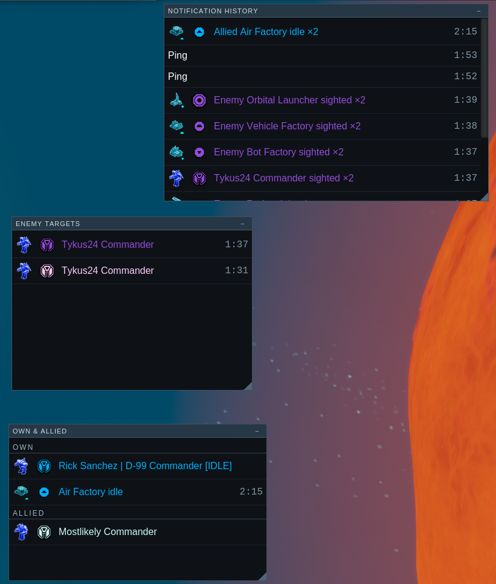
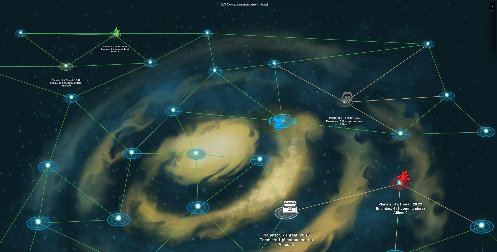
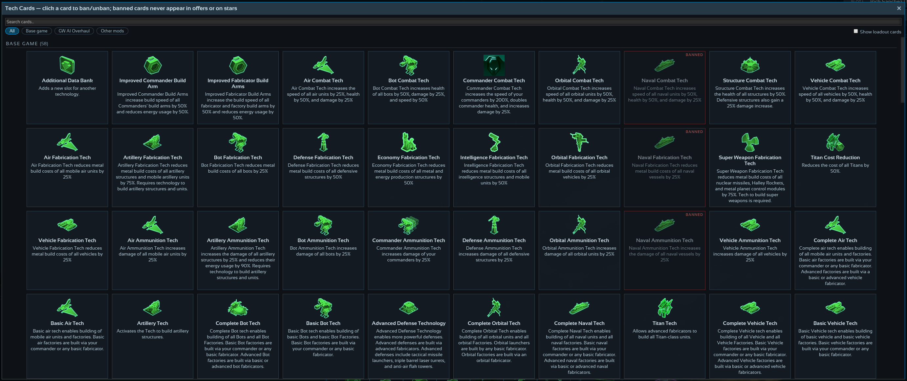
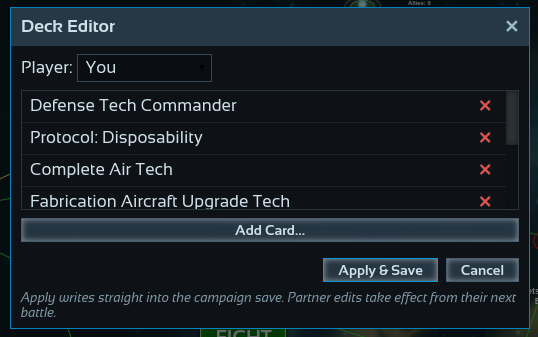
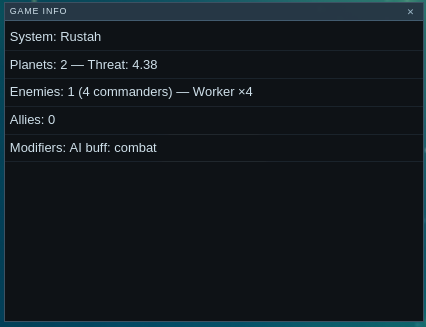
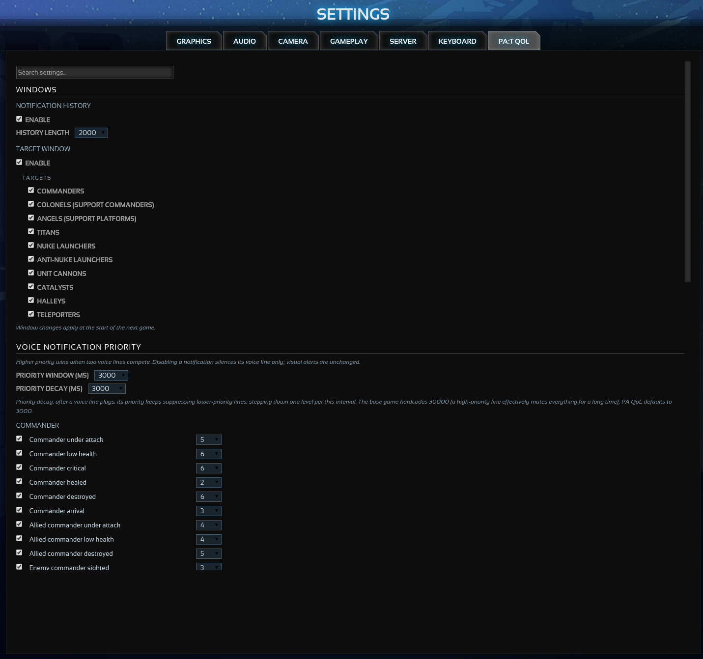
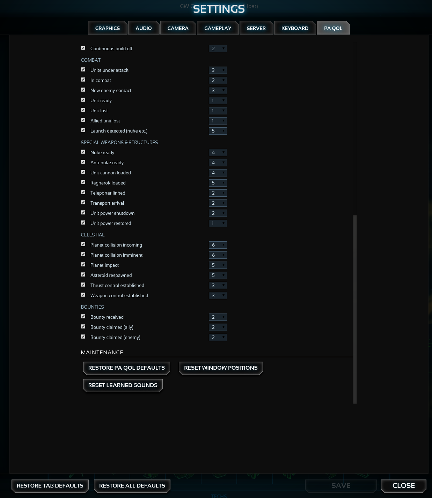
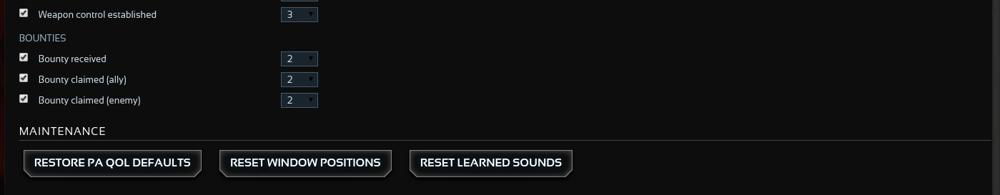

# PA:T QoL

Quality-of-life client mod for **Planetary Annihilation: TITANS**.
Identifier `com.lem0.pat-qol`, tested against build 124667.

## Table of contents

- [Features](#features)
- [Screenshots](#screenshots)
- [Install (players)](#install-players)
- [Install (development)](#install-development)
- [Development](#development)
- [Adding a feature](#adding-a-feature)
- [License](#license)

## Features

- **Notification priority** — enable/disable any voice notification and give
  it a priority (0–6). A "metal storage full" line can no longer stomp
  "commander under attack", and the vanilla 30-second priority decay (which
  let one alarm mute lower-priority lines for minutes) defaults to 3 s.
  Visual alerts are untouched; only audio is gated, and every unknown case
  fails open (vanilla behaviour).
- **Notification history** — a movable, resizable window with every
  notification of the match, stamped with game time, newest first. Click a
  row to jump the camera to where it happened. Repeats within 15 s coalesce
  into one ×N row (pings exempt — every ping stays its own row). Unlike the
  stock 5-slot strip, nothing expires and alerts that arrive while you are
  alt-tabbed are kept.
- **Enemy targets** — a movable, resizable window listing every spotted enemy
  high-value target: commanders, Colonels, Angels, Titans, nuke launchers,
  anti-nukes, unit cannons, Catalysts, Halleys and teleporters — each
  category individually toggleable. Click to jump there. Entries disappear on
  confirmed kill and dim when the sighting is stale.
- **Own Units / Own Structures / Allies** — three more windows. *Own
  Units*: your commander(s) (tagged `[IDLE]` when orderless), units in
  combat, **idle fabricators** grouped per planet, and **stuck units** — a
  ground unit holding a move/patrol order that has not moved for ~16 s shows
  as "<Unit> stuck ×N". *Own Structures*: idle factories that clear
  themselves once given work, plus **nuke, anti-nuke and unit cannon
  status** (Building n% / Preparing / green READY, munition stock n/3 or
  n/16 from the engine's ammo alerts). *Allies*: allied commanders and combat. Clicking a
  row jumps the camera AND selects what it points at (commander, idle
  factory, fabber group, stuck group, launcher) so re-tasking is one order
  away; launcher rows select on single click and jump on double click.
- **Armory extras** — locked commanders carry a **?** badge explaining how
  they are obtained (tournaments, ranked seasons, PTE/LABS, Kickstarter);
  bought commanders read **Purchased** instead of Owned; the Badges tab
  splits into Obtained / Not obtained with tooltips. Every for-sale tile has
  an in-place **Add to cart / Remove from cart** button (no tab yanking),
  the footer gains **Buy All Available ($total)** / **Remove All (n)** and a
  **Checkout ($total)** button, and the default-commander flow lives on the
  tiles: a blue **DEFAULT** pill (click to clear) and **SET DEFAULT** buttons.
- **Favorite commanders** — star any commander in the armory (top right of
  each tile); favorites sort to the top, right after your default. The same
  favorites carry into **Galactic War setup** (stock carousel and the
  GW-AI-Overhaul picker, both sorted, both with toggle stars) and the
  **game lobby** commander picker (skirmish and multiplayer) — one shared
  list, editable from all three screens.
- **Galactic War extras** — map travel moves 3× faster; every system with a
  living enemy shows an intel label under its star (planets, threat — the
  same formula GW-AI-Overhaul's intel screen uses — enemy armies and
  commander counts, allies); and during a GW battle the ESC menu gains a
  **Game Info** popup with that intel plus active modifiers (sudden death,
  bounty, eradication, AI buffs). In co-op (with GW-AI-Overhaul), every
  player gets their own guaranteed tech per system — pinned to the
  originally listed tech, re-rolled per player only once they own it, and
  shown per partner under Available Tech — plan routes together. Clicking **TECHS** above your
  inventory opens a card browser (search, base-game/GWO/other-mod sections)
  where any card can be **banned** from all future deals. An optional
  **deck editor** (settings, off by default) lets the host edit any
  player's cards on the war map to fix misclicked picks.

Rows in all windows carry the unit's build icon plus its orbit-style
strategic icon tinted in the owner's army colour (dark colours brightened
for readability), the unit's real in-game name, and a right-aligned game
timestamp. Right-click any row to dismiss it. A **Text & icon size** setting
(free-typed 50–300% with a live preview) scales all the mod's windows and
applies to running windows within seconds.

Configure everything under **Settings → PA:T QOL** (works from the main menu
and in-game). Enabling/disabling windows applies at the start of the next
game; the size setting applies immediately.

## Screenshots

The in-game windows — notification history (game-time stamps, ×N
coalescing, unit icons in owner colours), the enemy target list, and the
own/allied trio (commander with [IDLE] tag, idle factories, launcher
status):



The Galactic War map with intel labels under every living enemy system —
planets, threat (GW-AI-Overhaul's formula), enemy armies and commander
counts:



The tech card browser — click **TECHS** below your inventory on the war map
to browse every card with search, source filters and sections; clicking a
card bans/unbans it from all future deals:



The deck editor (optional, settings) and the in-game **Game Info** popup
from the ESC menu:





The **PA:T QOL** settings tab — search, window toggles with per-category
targets, and the voice priority controls:







## Install (players)

1. Download the newest ZIP — permanent link:
   **[com.lem0.pat-qol.zip](https://github.com/LeM0-Dev/planetary-annihilation-titans-qol-mod/releases/latest/download/com.lem0.pat-qol.zip)**
   (older versions under [Releases](https://github.com/LeM0-Dev/planetary-annihilation-titans-qol-mod/releases)).

2. Extract it into a folder named `com.lem0.pat-qol` inside PA's `client_mods`
   directory, so that `modinfo.json` ends up at
   `client_mods/com.lem0.pat-qol/modinfo.json`:

   **Windows** — press `Win`+`R`, paste the line below, press Enter; Explorer
   opens the right folder (usually
   `C:\Users\<your name>\AppData\Local\Uber Entertainment\Planetary Annihilation`):

   ```
   %LOCALAPPDATA%\Uber Entertainment\Planetary Annihilation
   ```

   Inside that folder:
   1. Create a new folder named exactly `client_mods` — it does **not** exist
      on a normal installation; only the game itself and folders like
      `download` and `log` will be there.
   2. Inside `client_mods`, create a folder named `com.lem0.pat-qol`.
   3. Extract the ZIP into it, so `modinfo.json` sits directly in that folder.

   (The `AppData` folder is hidden by default — the `Win`+`R` shortcut
   bypasses that.)

   **Linux** — create the same two folders under the PA data directory and
   extract the ZIP into the inner one:

   ```
   ~/.local/Uber Entertainment/Planetary Annihilation/client_mods/com.lem0.pat-qol/
   ```

   **macOS** — same structure:

   ```
   ~/Library/Application Support/Uber Entertainment/Planetary Annihilation/client_mods/com.lem0.pat-qol/
   ```

   Use real folders — PA does not follow symlinks.

3. Start PA:TITANS, open **Community Mods → Installed**, enable **PA:T QoL**
   (click *reload filesystem mods* if it is not listed), then restart the
   game. Mods mount at startup.

4. Configure under **Settings → PA:T QOL** — notification voice priorities and
   the in-game windows (notification history, enemy targets, own units,
   own structures, allies).

To update: replace the folder contents with the new ZIP and restart. To
uninstall: disable in Community Mods or delete the folder. All settings live
in PA's local storage under `com.lem0.pat-qol/*` keys and survive updates.

## Install (development)

```sh
tools/install-copy.sh        # rsyncs the runtime files into PA's client_mods/
                             # (installs as com.lem0.pat-qol.dev — CMM
                             # force-disables filesystem mods that share an
                             # identifier with a community-index mod)
                             # re-run after every edit, then restart PA
```

(`tools/install-symlink.sh` exists but PA's VFS does not follow symlinks —
verified on this setup — so the copy script is the working dev loop.)

Then enable **PA:T QoL** under Community Mods → Installed and restart PA.
Client mods mount at boot; there is no reliable hot reload — restart after
every change.

## Development

### Branches and releases

- **`staging`** — day-to-day work and all contributions. Open pull requests
  against `staging`, not `main`. The `check` workflow (lint + tests + release
  gate) runs on every PR and every push to it.
- **`main`** — the release branch. It only moves by promoting `staging`.

### Versioning and releasing

The version is set **manually, once per release**, on `staging`:

1. Edit `modinfo.json` → new `version`.
2. Add a `## <version> — <date>` section to `CHANGELOG.md` — releases
   without notes are rejected.
3. Run `tools/promote.sh`. It validates both (new version, changelog section
   present), syncs `paqol.VERSION`, runs the full check gate, pushes
   `staging`, and opens a **Release vX** PR onto `main`.

Merging that PR triggers the release workflow, which **fails on purpose** if
the version is already released or the changelog section is missing, and
otherwise publishes the GitHub release (versioned ZIP + stable
`com.lem0.pat-qol.zip` for the permanent latest-download URL). Releases are
only minted when shipped code (`ui/**`) changed.

### Tooling

```sh
npm install        # dev tooling only; nothing here ships
npm run check      # eslint (ES5 over ui/mods/**) + node --test + release gate
npm run package    # dist/com.lem0.pat-qol-<version>.zip
```

Read these before writing code:

- [`docs/architecture.md`](docs/architecture.md) — layout, feature registry,
  data flow
- [`docs/chrome40-house-rules.md`](docs/chrome40-house-rules.md) — the UI
  engine is ES5-only; what is banned and why
- [`docs/base-game-seams.md`](docs/base-game-seams.md) — every base-game
  file:line we depend on; re-diff after each PA patch
- [`docs/manual-test-checklist.md`](docs/manual-test-checklist.md) — the
  release gate that node cannot run
- [`AGENTS.md`](AGENTS.md), [`PA-MOD-CODING-RULES.md`](PA-MOD-CODING-RULES.md),
  [`OFFICIAL-DEV-INFO.md`](OFFICIAL-DEV-INFO.md) — mandatory policy

## Adding a feature

1. Create `ui/mods/com.lem0.pat-qol/features/<name>/feature.js`:

   ```js
   (function () {
       'use strict';
       paqol.registry.add({
           id: 'my_feature',
           scenes: ['live_game'],
           requires: ['model', 'ko'],   // dotted window paths, probed
           init: function (ctx) { /* ... */ }
       });
   })();
   ```

2. Add the file(s) to the matching `scenes` arrays in `modinfo.json`.
3. Pure logic goes in `shared/` with a `module.exports` tail guard and a test
   in `test/`.

A feature that throws in `init` is disabled alone with a console error; a
feature whose `requires` are missing (PA patch moved a seam) is skipped with
a warning. Other features keep running either way.

## License

[PA:T QoL Community License](LICENSE.md) — in short:

- **Personal/private use**: free, modify as you like.
- **Publishing a modified version**: allowed only if you contribute your
  changes back as a pull request against this repository. Keeping your own
  public fork is fine while you actively upstream its changes.
- **Commercial / for-profit use**: not permitted without written permission.
- The `js/audio.js` shadow and all game content remain the property of
  Planetary Annihilation Inc.; this is unaffiliated fan work.
